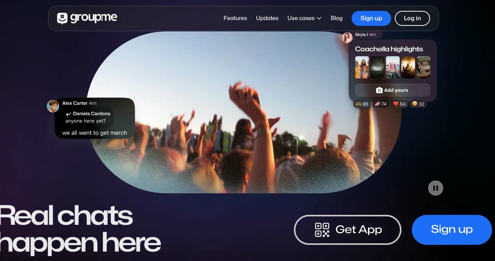
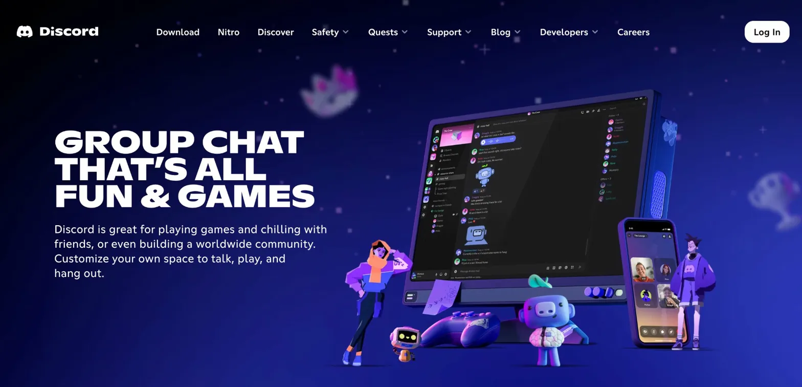
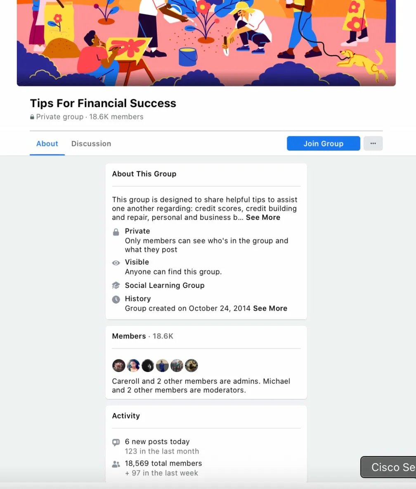
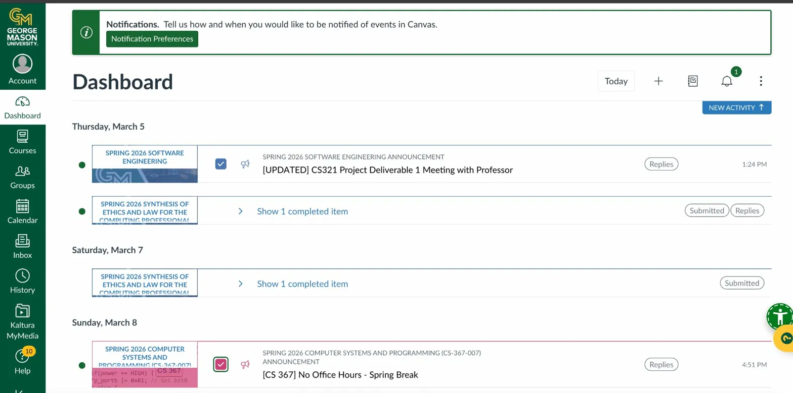

# Requirements Research

Screenshots and notes from competitor analysis conducted to identify the gaps that Campus Buddy addresses.

---

## Existing Platforms Students Currently Use

### GroupMe

GroupMe is a group messaging app widely used by students to coordinate study sessions and campus activities. However, it has **no identity verification** — anyone with the link can join a group, including people outside the university. There is no way to confirm that members are actual enrolled students.

---

### Discord

Discord is used by many student communities to create study servers and share resources. Like GroupMe, it is **completely open** — bots, scammers, and non-students can join public servers freely. As documented in our user stories, bot infiltration of student study servers is a real and recurring problem.

---

### Facebook Groups

Facebook Groups are used by students to organize study groups and sell textbooks. The platform has **no university filter** — groups are open to anyone and there is no way to verify that members attend the same school. This makes academic collaboration unreliable and marketplace transactions potentially unsafe.

---

### GMU Canvas

Canvas is GMU's official learning management system. While it is university-managed and course-specific, it has **no peer-to-peer collaboration features** — students cannot create study groups, post campus events, or exchange textbooks through it. It is strictly a one-way instructor-to-student tool.

---

## Existing Examples of What Students Are Trying to Do

### Campus Events

Students currently browse separate university event pages to find activities. There is no centralized feed restricted to verified students from their school.

### Study Groups

Students use public Facebook groups to organize study sessions. These groups are unstructured, open to non-students, and not tied to specific courses or universities.

### Textbook Marketplace

Students use third-party websites to buy and sell textbooks with no university context, no trust layer, and no guarantee that the other person is a classmate.

---

## Key Finding

Every existing platform either lacks identity verification or is not built for academic collaboration. No single tool combines verified student identity, study groups, campus events, and textbook exchange in one place. This gap is what Campus Buddy is designed to fill.
